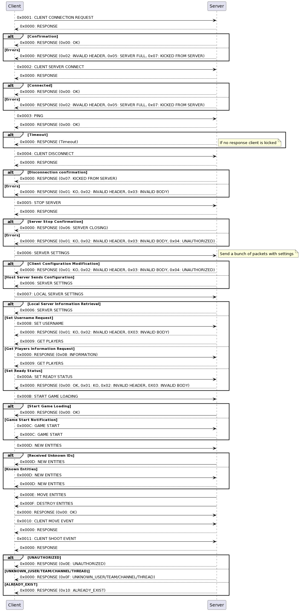

# R-Type ☕

<image align="left" src="assets/readme/cuphead_title.png" width="400" height="335" alt="Title">

Welcome to **R-Type** an action-packed multiplayer space shooter developped in C++. In this game, players navigate in self-made Cuphead like universe. With a stunning scrolling vintage background, the game offers an immersive experience. We have expanded the **game engine** to allow for modularity, efficient data transmission over the network, and advanced gameplay elements such as monsters, levels, and powerful boss fights. **R-Type** also offers content creation tools for game designers to easily add new content, making it a complete and fun gaming experience! 

---

<br>


<p align="center">
    <a href="https://isocpp.org">
      
    </a>
    <a href="https://cmake.org">
      
    <a>
    <a href="https://www.raylib.com">
      
    <br>
    
</p>


## Table of Contents 📋

1. [Gameplay](#gameplay-)
2. [Game Engine](#game-engine-%EF%B8%8F)
3. [Network](#network-)
4. [Installation](#installation--%EF%B8%8F)
5. [Usage](#usage-)
6. [Authors](#authors-%EF%B8%8F)

## Gameplay 🎮

The gameplay is simple, like **Cuphead**, you will be an airplane and you have to kill bosses with patterns. But you will have to be careful because you will have to dodge the bullets of the bosses and the monsters. You will have a life bar and if you lose all your life you will lose the game. Unlike Cuphead, this is networked game, so you can play with your friends to 4 players to kill the bosses.

Image of first boss fight : <br>


## Game Engine ⚙️

In this section, we explore the use of an **Entity Component System (ECS)** library for game development. **ECS** is a common software architecture for representing objects in a game world. It consists of entities composed of data components, with systems that operate on these components.

- **Components**: You'll learn how to create components such as Position and Velocity.

- **SparseArray**: Discover the SparseArray class used for efficient component storage.

- **Registry**: The Registry class manages entities, components, and systems. You'll see how to create, manage, and run systems.

For more details and examples, please refer to the full documentation [here](doc/HowToUSeTheECS.md).

## Network 📡

The **Network** section of this README pertains to the R-TYPE Client-Server Protocol, a custom communication protocol specifically designed for the our multiplayer video game. This protocol governs how clients and servers interact, allowing players to control spaceships, battle monsters, and more.

For comprehensive information on the R-TYPE Client-Server Protocol, please refer to the official [RFC document](doc/RTYPE-RFC.txt). The [RFC document](doc/RTYPE-RFC.txt) provides detailed insights into the structure of requests and responses, command types, error handling, and security considerations. It serves as a crucial resource for implementing and understanding the R-TYPE protocol.

To ensure smooth communication between clients and servers in the R-TYPE game, it is highly recommended to study the [RFC document](doc/RTYPE-RFC.txt).

Here is the sequence diagram of the protocol :



## Installation  🛠️

Follow the steps below to install this project:

1. **Download the correct package for your operating system.**
    - For Linux users: Download the Linux package.
    - For Windows users: Download the Windows package.
    - Note: macOS support is currently under development and will be available in a future update.

2. **Extract the package** to your desired location.

3. **Open a terminal** in the directory where you have extracted the files and execute the installation script for your OS:

    - **For Linux:**
    ```bash
    ./install.sh
    ```

    - **For Windows:**
    ```bash
    ./install.ps1
    ```

After running the installation script, you will have two executables: **Server** and **R-Type** available in your installation directory. To learn how to use these executables, please refer to the [Usage](#usage-) section of this document.

## Usage 🚀

To launch the server you just need to build the project and run the server executable like this :

```bash
./server [port]
```

and server will be listening on the port you specified.

To launch the client you just need to build the project and run the client executable like this :

```bash
./client
```

and you will have a window with the game.

## Authors ✒️
<p align="center">
  <a href="https://github.com/P4ST4S">
    
  </a>
  <a href="https://github.com/Linnchoeuh">
    
  </a>
  <a href="https://github.com/flwrenn">
    
  </a>
  <br>
  <a href="https://github.com/LebibYann">
    
  </a>
  <a href="https://github.com/ianophael">
    
  </a>
</p>
